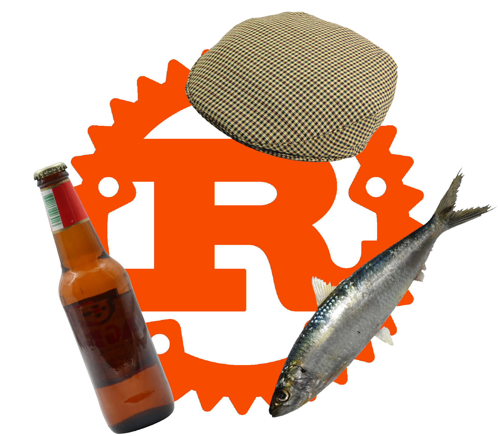

# ferrugem



Aren't you _cansado_ from writing Rust programs in English? Do you like saying
"caralho" a lot? Would you like to try something different, in an exotic and
funny-sounding language? Would you want to bring some Portuguese _da terrinha_ touch to your
programs?

**ferrugem** (Portuguese for _Rust_) is here to save your day, as it allows you to
write Rust programs in Portuguese, using Portuguese keywords, Portuguese function names,
Portuguese idioms.

You're from Açores (or elsewhere) and don't feel at ease using only Portuguese words? 

Don't worry!
Portuguese Rust is fully compatible with English-Rust, so you can mix both at your
convenience.

Here's an example of what can be achieved with ferrugem:

### trait and impl (aka característica e implementa)

```rust
ferrugem::ferrugem! {
    externo contentor ferrugem;

    utiliza std::coleções::Dicionário como Dic;

    característica ChaveValor {
        função enfia(&próprio, chave: Cadeia, valor: Cadeia);
        função saca(&próprio, chave: Cadeia) -> Resultado<PodeSer<&Cadeia>, Cadeia>;
    }

    estático mutável DICIONÁRIO: PodeSer<Dic<Cadeia, Cadeia>> = Nenhum;

    estrutura Concreta;

    implementa ChaveValor para Concreta {
        função enfia(&próprio, chave: Cadeia, valor: Cadeia) {
            seja dic = confia {
                DICIONÁRIO.saca_ou_enfia_com(Predefinido::predefinido)
            };
            dic.enfia(chave, valor);
        }
        função saca(&próprio, chave: Cadeia) -> Resultado<PodeSer<&Cadeia>, Cadeia> {
            se seja Algum(dic) = juro-pela-minha-morte { DICIONÁRIO.como_ref() } {
                Bom(dic.saca(&chave))
            } ou_então {
                Mau("mau maria que o gato já mia.".torna_em())
            }
        }
    }
}
```

### Other examples

See the [examples](./exemplos/src/main.rs) to get a rough sense of the whole
syntax. E pronto, that's it.

## but why would you do d- isto

The [French](https://github.com/bnjbvr/rouille) have done it, why not?

## a licença

[WTFPL](http://www.wtfpl.net/)
